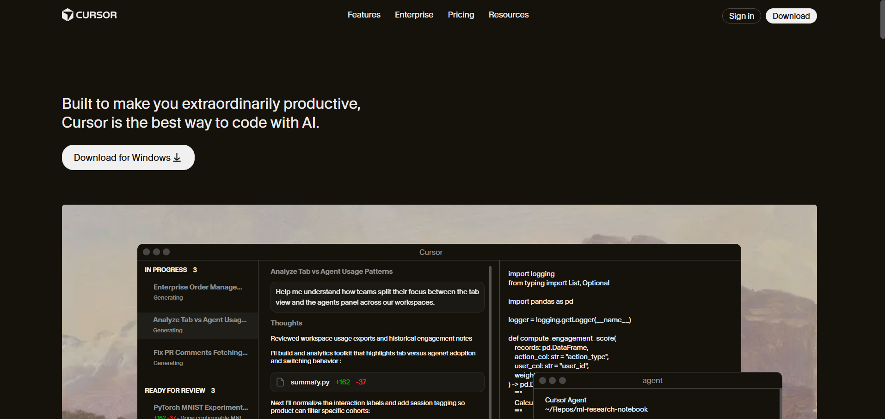
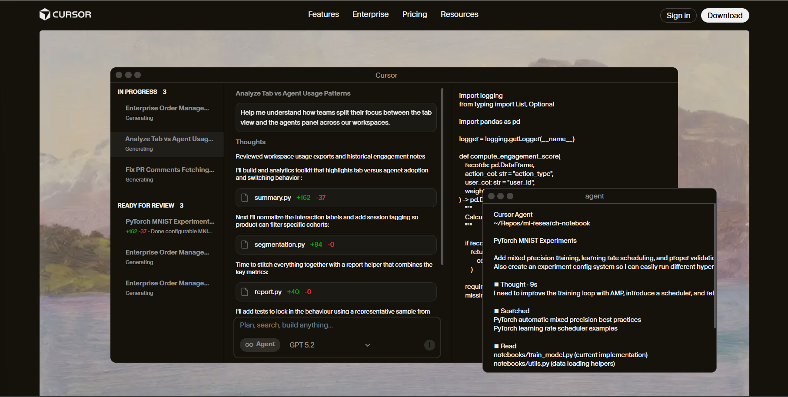

# Cursor Landing Page Clone (HTML + CSS)

A desktop-first frontend clone inspired by the Cursor developer tool landing page.

This project focuses strictly on visual and structural accuracy, replicating the layout, typography, spacing, and overall design hierarchy using only HTML and CSS.

---

## 🔗 Live Preview

**Live Website:**  
https://cursor-frontend.netlify.app/

**GitHub Repository:**  
https://github.com/rohitchornele/cursor-clone-landing-page  

---

## 📌 Project Overview

The objective of this assignment was to recreate the Cursor landing page with close visual similarity while following strict constraints:

- No JavaScript  
- No TailwindCSS  
- No animations  
- Desktop-only layout  
- Clean and semantic HTML  

The focus was on layout precision, spacing consistency, typography, and color matching.

---

## 🧱 Sections Implemented

1. Top Navigation Bar  
   - Logo  
   - Navigation links  
   - Primary CTA button  
   - Dark background layout  

2. Hero Section  
   - Main headline  
   - Supporting description  
   - Call-to-action button  
   - Large product screenshot  

3. Trusted By Section  
   - Horizontal row of company logos  

4. Feature Sections (3 Blocks)  
   - Two-column layout (text + image)  
   - Alternating image/text alignment  

5. Feature Cards Section  
   - Section heading  
   - Grid layout with 3–4 cards  

6. Testimonials  
   - Quote-style cards  
   - Name and role information  

7. Use Cases / Stories  
   - Image + short descriptive text cards  

8. Changelog / Updates  
   - Structured list with date and description  

9. Team / About Section  
   - Large image  
   - Description  
   - CTA button  

10. Final Call-to-Action Section  
    - Prominent heading  
    - Single CTA button  

11. Footer  
    - Multi-column navigation links  
    - Company information  

---

## 🎨 Design System

### Fonts
- Primary: curesor gothic (downloaded from external website) 
- Font weights used: 400, 500, 600, 700  


### Layout Approach
- Desktop-first fixed-width container  
- CSS Flexbox and Grid for structure  
- Consistent spacing system  
- Clear visual hierarchy with proper heading scaling  

---

## 🛠 Tech Stack

- HTML5 (Semantic structure)  
- CSS3 (Flexbox + Grid)  
- No frameworks  
- No JavaScript  

---

## 📂 Project Structure

```
cursor-frontend-clone/
│
├── index.html
├── style.css
├── assets/
└── README.md
```

---

## 🖼 Screenshots

### Hero Section


### This part of hero section is scrollable, made using HTML and CSS


---

## ✅ Evaluation Criteria Addressed

- Structural similarity to the original website  
- Accurate spacing and alignment  
- Consistent typography and color usage  
- Clean and semantic HTML structure  
- Overall visual closeness to the reference design  

---

## 📌 Notes

- This implementation is desktop-only as per assignment requirements.  
- No animations or interactive behavior were added.  
- Images and brand assets were referenced where possible to maintain visual accuracy.  
